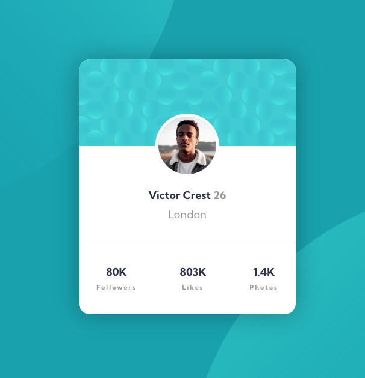

# Frontend Mentor - Profile card component solution

This is a solution to the [Profile card component challenge on Frontend Mentor](https://www.frontendmentor.io/challenges/profile-card-component-cfArpWshJ). Frontend Mentor challenges help you improve your coding skills by building realistic projects. 

## Table of contents

- [Overview](#overview)
  - [Screenshot](#screenshot)
  - [Links](#links)
- [My process](#my-process)
  - [Built with](#built-with)
  - [What I learned](#what-i-learned)
  - [Continued development](#continued-development)
- [Author](#author)

---

## Overview

### Screenshot



### Links

- Solution URL: [Frontend solution](https://www.frontendmentor.io/solutions/profile-card-component-using-flexbox-ubjyu9jz5B)
- Live Site URL: [Live site with GitHub Pages](https://marioferrer.github.io/FM-01_profile-card-component/)

## My process

### Built with

- Semantic HTML5 markup
- CSS custom properties
- Flexbox


### What I learned

With this challenge I have learned how to place several images in the same container and how to position them. 

The code is this:


```css
background-color: var(--darkCyan);
background-image:
  url(../images/bg-pattern-top.svg),
  url(../images/bg-pattern-bottom.svg);
background-position:
  top -50vh right 50vw,
  top 50vh left 50vw;
background-repeat: no-repeat;
```

### Continued development

I need to improve on how to approach the project when naming the classes and structuring the html. I also need to work on breakpoints and responsive design.

## Author

- Github - [My GitHub Profile](https://github.com/marioferrer)
- Frontend Mentor - [@marioferrer](https://www.frontendmentor.io/profile/marioferrer)


